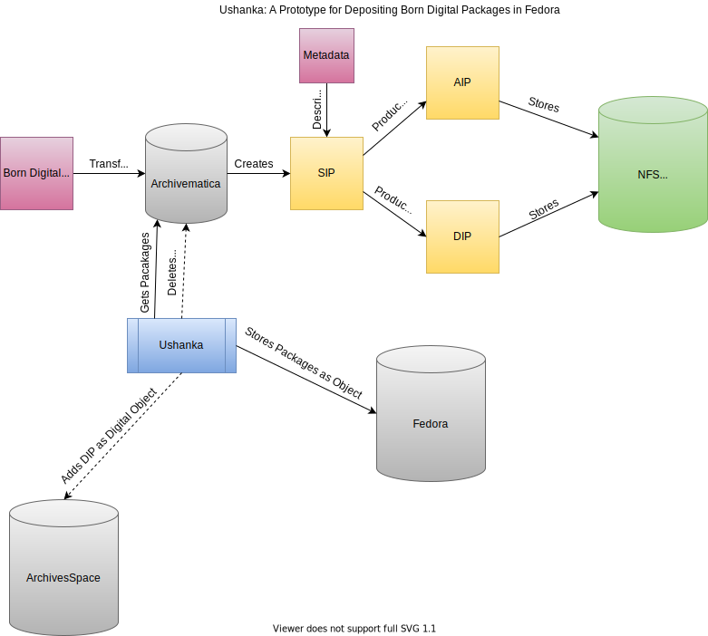
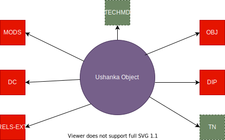

# Ushanka

This is a temporary repository for thinking about how to get a finalized AIP and DIP to our instance of Fedora.

## What is this supposed to do?

Ushanka gets AIPs and DIPs from Archivematica and a storage service and deposits it in Fedora.



Currently, it does not delete the package in Archivematica.  While this would be easy to do, I wanted to first focus on
thinking about the steps up through storage and what should go into Fedora.

## What does the final object look like?

Right now, I've modelled this as a traditional Binary Object.

Arguably, we should separate the AIP and DIP and treat the parts of the DIPs as single objects.



Currently, the object has no TN or TECHMD datastreams.  Its RDF looks like this.

```turtle
@prefix ns0: <info:fedora/fedora-system:def/relations-external#> .
@prefix ns1: <info:fedora/fedora-system:def/model#> .

<info:fedora/test:27>
  ns0:isMemberOfCollection <info:fedora/islandora:test> ;
  ns1:hasModel <info:fedora/islandora:binaryObjectCModel> .
```