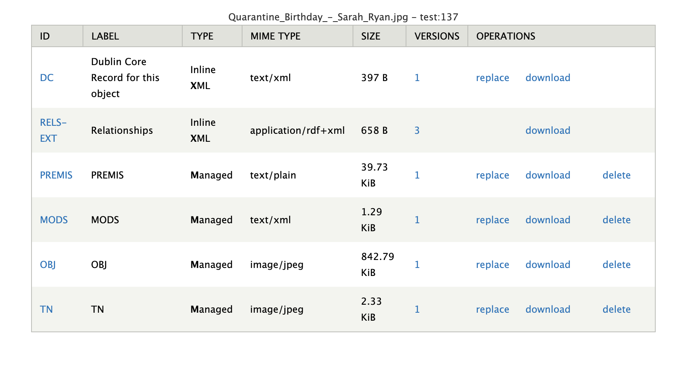

Digital Asset Management of Born Digital Materials
==================================================

Once a SIP has been created with Archivematica, it is ready to be ingested into our digital asset management system.  This document describes its
shape and relationships between the various parts.

The Compound Object
-------------------

The SIP is a compound object, which is a collection of related objects.  The compound object is the top-level object in
the digital assets management system.  Each compound object is prescribed with several datastreams, including:

* MODS:  This metadata file contains basic descriptive information about the compound object, including title, identifier, date, and an abstract.
* RELS-EXT:  This metadata file contains relationships between the compound object and other objects in the digital asset management system.
* DC:  This metadata file contains descriptive information about the compound object, including title, identifier, date, and an abstract. It accompanies the MODS so that the properties are interoperable in our triple store.
* AIP: This datastream contains the AIP, which is a compressed file containing the original SIP and any migrated files important for preservation.
* DIP: This datastream contains the DIP, which is a compressed file containing the derivatives most appropriate for access.
* METS: This datastream contains the METS file, which is a metadata file that describes the structure of the SIP, AIP, and DIP.
* POLICY: This datastream contains the policy file, which is a metadata file that describes the rights and access restrictions for the compound object.

The relationships between the compound object and its files can be understood with the following diagram:

.. mermaid::

    erDiagram
        COMPOUNDOBJECT ||--o{ MODS : has
        COMPOUNDOBJECT ||--o{ RELS-EXT : has
        COMPOUNDOBJECT ||--o{ DC : has
        COMPOUNDOBJECT ||--o{ AIP : has
        COMPOUNDOBJECT ||--o{ DIP : has
        COMPOUNDOBJECT ||--o{ METS : has
        COMPOUNDOBJECT ||--o{ POLICY : has
        COMPOUNDOBJECT }|..|{ DIP-PART : contains

It may be helpful to also look at how the compound object is represented in Fedora:

.. image:: ../images/compound_object_islandor.png

The METS file can be used with a service like <Mets Flask `http://bitarchivist.pythonanywhere.com/`>_ to visualize the contents of the born digital object.

The viewer can be used to understand all the files that were in the original SIP, and how they were organized.

Technical metadata for each file can be accessed in the viewer.

This section also includes an easy to read version of all Premis events that were performed on the file during processing:

Explanation of the DIP Parts that are associated with each compound object can be found in the next section.

The DIP Part(s)
---------------

In order to enable any future access to files a part of the original SIP, the compound object is split into many DIP
parts. Each DIP part is a work with its own descriptive metadata, relationships, and access restrictions.  Each DIP part
is prescribed with several datastreams, including:

* MODS:  This metadata file contains basic descriptive information about the DIP part, including title, identifier, date, and an abstract.
* RELS-EXT:  This metadata file contains relationships between the DIP part and other objects in the digital asset management system.
* DC:  This metadata file contains descriptive information about the DIP part, including title, identifier, date, and an abstract. It accompanies the MODS so that the properties are interoperable in our triple store.
* PREMIS: This datastream contains the PREMIS file, which is a metadata file that describes the provenance of the DIP part.
* POLICY: This datastream contains the policy file, which is a metadata file that describes the rights and access restrictions for the DIP part.
* OBJ: This datastream contains the primary file from the DIP that the other files describe.
* TN: If the OBJ is and image or image-like file, this datastream contains a thumbnail of the OBJ.
* OCR: If the OBJ has searchable text, this datastream contains the OCR text so that it can be indexed by Solr.

The relationships between the DIP part and its files can be understood with the following diagram:

.. mermaid::

    erDiagram
        COMPOUNDOBJECT }|..|{ DIP-PART : contains
        COMPOUNDOBJECT }|..|{ DIP-PART2 : contains
        DIP-PART ||--o{ MODS : has
        DIP-PART ||--o{ RELS-EXT : has
        DIP-PART ||--o{ DC : has
        DIP-PART ||--o{ PREMIS : has
        DIP-PART ||--o{ POLICY : has
        DIP-PART ||--o{ OBJ : has

It may be helpful to also look at how the DIP part is represented in Fedora:

The Premis and technical metadata for the DIP part is stored with it so that it can be indexed and understood. Example
technical metadata may look like this:

.. code:: xml

    <System:FileSize>3.9 MB</System:FileSize>
    <System:FileModifyDate>2020:04:28 14:52:40+00:00</System:FileModifyDate>
    <System:FileAccessDate>2023:03:27 18:26:33+00:00</System:FileAccessDate>
    <System:FileInodeChangeDate>2023:03:27 18:26:15+00:00</System:FileInodeChangeDate>
    <System:FilePermissions>rw-rw-r--</System:FilePermissions>
    <File:FileType>JPEG</File:FileType>
    <File:FileTypeExtension>jpg</File:FileTypeExtension>
    <File:MIMEType>image/jpeg</File:MIMEType>
    <File:ExifByteOrder>Little-endian (Intel, II)</File:ExifByteOrder>
    <File:CurrentIPTCDigest>5762ecb339369a69cfa111f6c4a4e78b</File:CurrentIPTCDigest>
    <File:ImageWidth>5334</File:ImageWidth>
    <File:ImageHeight>4000</File:ImageHeight>
    <File:EncodingProcess>Baseline DCT, Huffman coding</File:EncodingProcess>
    <File:BitsPerSample>8</File:BitsPerSample>
    <File:ColorComponents>3</File:ColorComponents>
    <File:YCbCrSubSampling>YCbCr4:4:4 (1 1)</File:YCbCrSubSampling>
    <IFD0:Make>Canon</IFD0:Make>
    <IFD0:Model>Canon EOS Rebel T6i</IFD0:Model>
    <IFD0:Orientation>Horizontal (normal)</IFD0:Orientation>
    <IFD0:XResolution>300</IFD0:XResolution>
    <IFD0:YResolution>300</IFD0:YResolution>
    <IFD0:ResolutionUnit>inches</IFD0:ResolutionUnit>
    <IFD0:Software>Adobe Photoshop 21.1 (Macintosh)</IFD0:Software>
    <IFD0:ModifyDate>2020:04:27 22:13:51</IFD0:ModifyDate>
    <ExifIFD:ExposureTime>1/250</ExifIFD:ExposureTime>
    <ExifIFD:FNumber>1.8</ExifIFD:FNumber>

This file also contains important information about the provenance of the file, including the original path:

.. code:: xml

    <premis:originalName>
        %transferDirectory%objects/Chronicling COVID-19_ Submission form for creative works (File responses)/Please upload your files here. You may upload up to 10 files. Please use the form again to submit additional files. (File responses)/Quarantine Birthday - Sarah Ryan.jpg
    </premis:originalName>

The original path can also be found in the MODS file to make the information easy for migration and reuse in ArchivesSpace.

.. code:: xml

    <note>
        Chronicling COVID-19_ Submission form for creative works (File responses)/Please upload your files here. You may upload up to 10 files. Please use the form again to submit additional files. (File responses)/Quarantine Birthday - Sarah Ryan.jpg
    </note>

